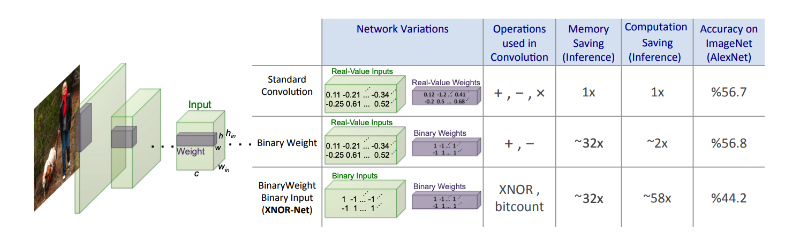

# Must Go Fast

A collection of papers related to making DNNs faster, either by network compression, or knowledge distillation.

**Techniques**:

1. [Compact Layers / Shallow Networks](#compactshallow)
1. [Compressing Pre-Trained Networks](#compress)
1. [Network Quantization and Binarization](#qb)
1. [Knowledge Distillation](#distillation)

---

## Compact Layers / Shallow Networks 

This works by first training a deep neural network and then replacing some parts, or even all, with a shallower or more compact network. The shallow part must mimic the behavior of the original part.

**List of Papers:**

1. SqueezeNet: AlexNet-level accuracy with 50x fewer parameters and <0.5MB model size. (2016) [[Arxiv](https://arxiv.org/abs/1602.07360)][[Github](https://github.com/forresti/SqueezeNet)]

---

## Compressing Pre-Trained Networks 

There are a handful of techniques to remove redundancy in a trained neural network. For exampl after training, one can prune/delete some unimportant parts of the network, that's it, deleting some connection in the network. The key challenge in this to find candidate connections.

**Two Major Category for weight pruning**:

* The General, Non-Structured Pruning: Removing any connection and weights. It has no limitation for delete a connection but sometimes this method interferes with Highly Parallel and Vectorize implementation of Neural Networks, like in GPUs, which hinders the maximum speed up.
* Structured pruning: Systematically remove some connection and weights, like removing an entire channel, layer, etc.

**List of Papers:**

1. Optimal Brain Damage. (1989) [[PDF](http://papers.nips.cc/paper/250-optimal-brain-damage.pdf)]
1. Second order derivatives for network pruning: Optimal Brain Surgeon (1993). [[PDF](http://papers.nips.cc/paper/647-second-order-derivatives-for-network-pruning-optimal-brain-surgeon.pdf)]
1. Exploiting Linear Structure Within Convolutional Networks for Efficient Evaluation. (2014) [[Arxiv](https://arxiv.org/abs/1404.0736)]
1. Speeding up Convolutional Neural Networks with Low Rank Expansions. (2014) [[Arxiv](https://arxiv.org/abs/1405.3866)]
1. Learning both Weights and Connections for Efficient Neural Networks. (2015) [[Arxiv](https://arxiv.org/abs/1506.02626)]
1. Deep Compression: Compressing Deep Neural Networks with Pruning, Trained Quantization and Huffman Coding. (2015) [[Arxiv](https://arxiv.org/abs/1510.00149)]
1. Compressing Neural Networks with the Hashing Trick. (2015) [[Arxiv](https://arxiv.org/abs/1504.04788)]
1. Dynamic Network Surgery for Efficient DNNs. 2016 [[Arxiv](https://arxiv.org/abs/1608.04493)]
1. Channel Pruning for Accelerating Very Deep Neural Networks. 2017 [[Arxiv](https://arxiv.org/abs/1707.06168)]
1. AMC: AutoML for Model Compression and Acceleration on Mobile Devices. 2018 [[Arxiv](https://arxiv.org/abs/1802.03494)]
1. AutoCompress: An Automatic DNN Structured Pruning Framework for Ultra-High Compression Rates. (2019) [[Arxiv](https://arxiv.org/abs/1907.03141)]

---

## Network Quantization and Binarization 

Quantization refers to a set of techniques in which we reduce the number of bits needed to represent network weights. that's it, instead of storing all weights as a ``float32`` we reduce it to ``float16``, ``float8`` and in its extreme case, we use only ``1-bit`` or ``binary``mode for representing weights.

**List of Papers:**

1. Improving the speed of neural networks on CPUs. (2011) [[PDF](https://static.googleusercontent.com/media/research.google.com/en//pubs/archive/37631.pdf)]
1. Compressing Deep Convolutional Networks using Vector Quantization. (2014) [[Arxiv](https://arxiv.org/abs/1412.6115)]
1. [XNOR-Net](#xnornet): ImageNet Classification Using Binary Convolutional Neural Networks. (2016) [[Arxiv](https://arxiv.org/abs/1603.05279)] [[Official Website](http://allenai.org/plato/xnornet)][[Github](https://github.com/allenai/XNOR-Net)]
1. [XNOR-Net++](#xnornetplusplus): Improved binary neural networks (2019) [[Arxiv](https://arxiv.org/abs/1909.13863)]

### 2016 | XNOR-Net: ImageNet Classification Using Binary Convolutional Neural Networks 

This method doesn't rely on a pre-trained network. It introduces a novel method for learning Binary neural networks from scratch. This works by estimating binary value of weights by scaling the original weight. It stores the original weight for backpropagation and training, but in the inference stage, it only uses the binarized version of the weight.

#### Abstract

We propose two efficient approximations to standard convolutional neural networks: Binary-Weight-Networks and XNOR-Networks. In Binary-Weight-Networks, the filters are approximated with binary values resulting in 32x memory saving. In XNOR-Networks, both the filters and the input to convolutional layers are binary. XNOR-Networks approximate convolutions using primarily binary operations. This results in 58x faster convolutional operations and 32x memory savings. XNOR-Nets offer the possibility of running state-of-the-art networks on CPUs (rather than GPUs) in real-time. Our binary networks are simple, accurate, efficient, and work on challenging visual tasks. We evaluate our approach on the ImageNet classification task. The classification accuracy with a Binary-Weight-Network version of AlexNet is only 2.9% less than the full-precision AlexNet (in top-1 measure). We compare our method with recent network binarization methods, BinaryConnect and BinaryNets, and outperform these methods by large margins on ImageNet, more than 16% in top-1 accuracy.

### 2019 | XNOR-Net++: Improved binary neural networks 

A follow up work to [XNOR-Net](#xnornet).

#### Abstract

This paper proposes an improved training algorithm for binary neural networks in which both weights and activations are binary numbers. A key but fairly overlooked feature of the current state-of-the-art method of XNOR-Net is the use of analytically calculated real-valued scaling factors for re-weighting the output of binary convolutions. We argue that analytic calculation of these factors is sub-optimal. Instead, in this work, we make the following contributions: (a) we propose to fuse the activation and weight scaling factors into a single one that is learned discriminatively via backpropagation. (b) More importantly, we explore several ways of constructing the shape of the scale factors while keeping the computational budget fixed. (c) We empirically measure the accuracy of our approximations and show that they are significantly more accurate than the analytically calculated one. (d) We show that our approach significantly outperforms XNOR-Net within the same computational budget when tested on the challenging task of ImageNet classification, offering up to 6\% accuracy gain.

---

## Knowledge Distillation 

**List of Papers:**
