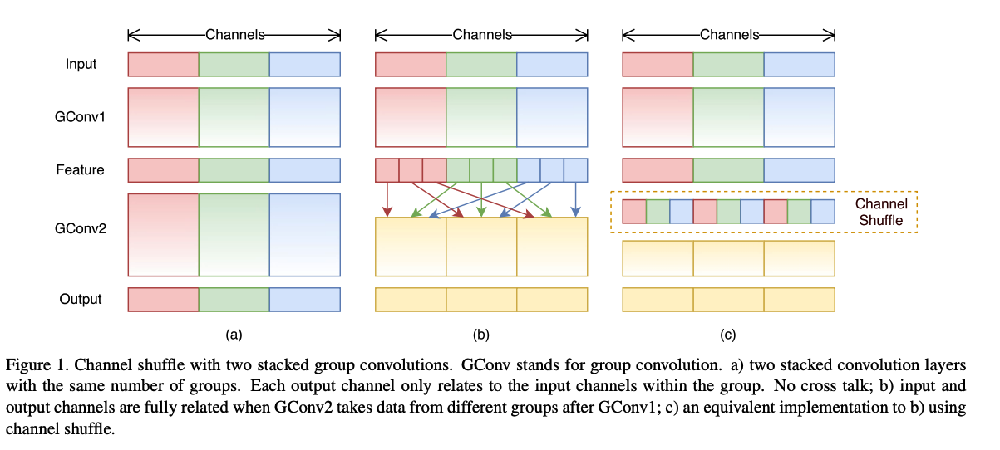

# Must Go Fast

A collection of papers related to making DNNs faster, either by network compression, or knowledge distillation.

**Techniques**:

1. [Compact Layers / Shallow Networks](#compactshallow)
1. [Compressing Pre-Trained Networks](#compress)
1. [Network Quantization and Binarization](#qb)
1. [Knowledge Distillation](#distillation)

---

## Compact Layers / Shallow Networks 

This works in either of these ways:

1. Replace some part of a trained network with a shallower or compact counterpart
1. Create a New network based on some "Compact" layers. for example, instead of using 3x3 convolutional layers, we use 1x1 layers.

**List of Papers:**

1. SqueezeNet: AlexNet-level accuracy with 50x fewer parameters and <0.5MB model size. (2016) [[Abstract](#shallownetwokid0)] [[Arxiv](https://arxiv.org/abs/1602.07360)]
1. MobileNets: Efficient Convolutional Neural Networks for Mobile Vision Applications. (2017) [[Abstract](#shallownetwokid1)] [[Arxiv](https://arxiv.org/abs/1704.04861)]
1. ShuffleNet: An Extremely Efficient Convolutional Neural Network for Mobile Devices. (2017) [[Abstract](#shallownetwokid2)] [[Arxiv](https://arxiv.org/abs/1707.01083)]
1. MobileNetV2: Inverted Residuals and Linear Bottlenecks. (2018) [[Abstract](#shallownetwokid3)] [[Arxiv](https://arxiv.org/abs/1801.04381)]
1. ShuffleNet V2: Practical Guidelines for Efficient CNN Architecture Design. (2018) [[Abstract](#shallownetwokid4)] [[Arxiv](https://arxiv.org/abs/1807.11164)]
1. Searching for MobileNetV3. (2019) [[Abstract](#shallownetwokid5)] [[Arxiv](https://arxiv.org/abs/1905.02244)]

#### Abstract

### 2016 | SqueezeNet: AlexNet-level accuracy with 50x fewer parameters and <0.5MB model size 

Recent research on deep neural networks has focused primarily on improvingaccuracy. For a given accuracy level, it is typically possible to identifymultiple DNN architectures that achieve that accuracy level. With equivalentaccuracy, smaller DNN architectures offer at least three advantages: (1) Smaller DNNs require less communication across servers during distributedtraining. (2) Smaller DNNs require less bandwidth to export a new model fromthe cloud to an autonomous car. (3) Smaller DNNs are more feasible to deploy onFPGAs and other hardware with limited memory. To provide all of theseadvantages, we propose a small DNN architecture called SqueezeNet. SqueezeNetachieves AlexNet-level accuracy on ImageNet with 50x fewer parameters.Additionally, with model compression techniques we are able to compressSqueezeNet to less than 0.5MB (510x smaller than AlexNet).

### 2017 | MobileNets: Efficient Convolutional Neural Networks for Mobile Vision Applications 

We present a class of efficient models called MobileNets for mobile andembedded vision applications. MobileNets are based on a streamlinedarchitecture that uses depth-wise separable convolutions to build light weightdeep neural networks. We introduce two simple global hyper-parameters thatefficiently trade off between latency and accuracy. These hyper-parametersallow the model builder to choose the right sized model for their applicationbased on the constraints of the problem. We present extensive experiments onresource and accuracy tradeoffs and show strong performance compared to otherpopular models on ImageNet classification. We then demonstrate theeffectiveness of MobileNets across a wide range of applications and use casesincluding object detection, finegrain classification, face attributes and largescale geo-localization.

### 2017 | ShuffleNet: An Extremely Efficient Convolutional Neural Network for Mobile Devices 

We introduce an extremely computation-efficient CNN architecture namedShuffleNet, which is designed specially for mobile devices with very limitedcomputing power (e.g., 10-150 MFLOPs). The new architecture utilizes two newoperations, pointwise group convolution and channel shuffle, to greatly reducecomputation cost while maintaining accuracy. Experiments on ImageNetclassification and MS COCO object detection demonstrate the superiorperformance of ShuffleNet over other structures, e.g. lower top-1 error(absolute 7.8%) than recent MobileNet on ImageNet classification task, underthe computation budget of 40 MFLOPs. On an ARM-based mobile device, ShuffleNetachieves ~13x actual speedup over AlexNet while maintaining comparableaccuracy.

### 2018 | MobileNetV2: Inverted Residuals and Linear Bottlenecks 

In this paper we describe a new mobile architecture, MobileNetV2, thatimproves the state of the art performance of mobile models on multiple tasksand benchmarks as well as across a spectrum of different model sizes. We alsodescribe efficient ways of applying these mobile models to object detection ina novel framework we call SSDLite. Additionally, we demonstrate how to buildmobile semantic segmentation models through a reduced form of DeepLabv3 whichwe call Mobile DeepLabv3.

### 2018 | ShuffleNet V2: Practical Guidelines for Efficient CNN Architecture Design 

Currently, the neural network architecture design is mostly guided by the\emph{indirect} metric of computation complexity, i.e., FLOPs. However, the\emph{direct} metric, e.g., speed, also depends on the other factors such asmemory access cost and platform characterics. Thus, this work proposes toevaluate the direct metric on the target platform, beyond only consideringFLOPs. Based on a series of controlled experiments, this work derives severalpractical \emph{guidelines} for efficient network design. Accordingly, a newarchitecture is presented, called \emph{ShuffleNet V2}. Comprehensive ablationexperiments verify that our model is the state-of-the-art in terms of speed andaccuracy tradeoff.

### 2019 | Searching for MobileNetV3 

We present the next generation of MobileNets based on a combination ofcomplementary search techniques as well as a novel architecture design.MobileNetV3 is tuned to mobile phone CPUs through a combination ofhardware-aware network architecture search (NAS) complemented by the NetAdaptalgorithm and then subsequently improved through novel architecture advances.This paper starts the exploration of how automated search algorithms andnetwork design can work together to harness complementary approaches improvingthe overall state of the art. Through this process we create two new MobileNetmodels for release: MobileNetV3-Large and MobileNetV3-Small which are targetedfor high and low resource use cases. These models are then adapted and appliedto the tasks of object detection and semantic segmentation. For the task ofsemantic segmentation (or any dense pixel prediction), we propose a newefficient segmentation decoder Lite Reduced Atrous Spatial Pyramid Pooling(LR-ASPP). We achieve new state of the art results for mobile classification,detection and segmentation. MobileNetV3-Large is 3.2\% more accurate onImageNet classification while reducing latency by 15\% compared to MobileNetV2.MobileNetV3-Small is 4.6\% more accurate while reducing latency by 5\% comparedto MobileNetV2. MobileNetV3-Large detection is 25\% faster at roughly the sameaccuracy as MobileNetV2 on COCO detection. MobileNetV3-Large LR-ASPP is 30\%faster than MobileNetV2 R-ASPP at similar accuracy for Cityscapes segmentation.

---

## Compressing Pre-Trained Networks 

There are a handful of techniques to remove redundancy in a trained neural network. For exampl after training, one can prune/delete some unimportant parts of the network, that's it, deleting some connection in the network. The key challenge in this to find candidate connections.

**Two Major Category for weight pruning**:

* The General, Non-Structured Pruning: Removing any connection and weights. It has no limitation for delete a connection but sometimes this method interferes with Highly Parallel and Vectorize implementation of Neural Networks, like in GPUs, which hinders the maximum speed up.
* Structured pruning: Systematically remove some connection and weights, like removing an entire channel, layer, etc.

**List of Papers:**

1. Optimal Brain Damage. (1989) [[PDF](http://papers.nips.cc/paper/250-optimal-brain-damage.pdf)]
1. Second order derivatives for network pruning: Optimal Brain Surgeon (1993). [[PDF](http://papers.nips.cc/paper/647-second-order-derivatives-for-network-pruning-optimal-brain-surgeon.pdf)]
1. Exploiting Linear Structure Within Convolutional Networks for Efficient Evaluation. (2014) [[Arxiv](https://arxiv.org/abs/1404.0736)]
1. Speeding up Convolutional Neural Networks with Low Rank Expansions. (2014) [[Arxiv](https://arxiv.org/abs/1405.3866)]
1. Learning both Weights and Connections for Efficient Neural Networks. (2015) [[Arxiv](https://arxiv.org/abs/1506.02626)]
1. Deep Compression: Compressing Deep Neural Networks with Pruning, Trained Quantization and Huffman Coding. (2015) [[Arxiv](https://arxiv.org/abs/1510.00149)]
1. Compressing Neural Networks with the Hashing Trick. (2015) [[Arxiv](https://arxiv.org/abs/1504.04788)]
1. Dynamic Network Surgery for Efficient DNNs. 2016 [[Arxiv](https://arxiv.org/abs/1608.04493)]
1. Channel Pruning for Accelerating Very Deep Neural Networks. 2017 [[Arxiv](https://arxiv.org/abs/1707.06168)]
1. AMC: AutoML for Model Compression and Acceleration on Mobile Devices. 2018 [[Arxiv](https://arxiv.org/abs/1802.03494)]
1. AutoCompress: An Automatic DNN Structured Pruning Framework for Ultra-High Compression Rates. (2019) [[Arxiv](https://arxiv.org/abs/1907.03141)]

---

## Network Quantization and Binarization 

Quantization refers to a set of techniques in which we reduce the number of bits needed to represent network weights. that's it, instead of storing all weights as a ``float32`` we reduce it to ``float16``, ``float8`` and in its extreme case, we use only ``1-bit`` or ``binary``mode for representing weights.

**List of Papers:**

1. Improving the speed of neural networks on CPUs. (2011) [[PDF](https://static.googleusercontent.com/media/research.google.com/en//pubs/archive/37631.pdf)]
1. Compressing Deep Convolutional Networks using Vector Quantization. (2014) [[Arxiv](https://arxiv.org/abs/1412.6115)]
1. [XNOR-Net](#xnornet): ImageNet Classification Using Binary Convolutional Neural Networks. (2016) [[Arxiv](https://arxiv.org/abs/1603.05279)] [[Official Website](http://allenai.org/plato/xnornet)][[Github](https://github.com/allenai/XNOR-Net)]
1. [XNOR-Net++](#xnornetplusplus): Improved binary neural networks (2019) [[Arxiv](https://arxiv.org/abs/1909.13863)]

### 2016 | XNOR-Net: ImageNet Classification Using Binary Convolutional Neural Networks 

This method doesn't rely on a pre-trained network. It introduces a novel method for learning Binary neural networks from scratch. This works by estimating binary value of weights by scaling the original weight. It stores the original weight for backpropagation and training, but in the inference stage, it only uses the binarized version of the weight.

#### Abstract

We propose two efficient approximations to standard convolutional neural networks: Binary-Weight-Networks and XNOR-Networks. In Binary-Weight-Networks, the filters are approximated with binary values resulting in 32x memory saving. In XNOR-Networks, both the filters and the input to convolutional layers are binary. XNOR-Networks approximate convolutions using primarily binary operations. This results in 58x faster convolutional operations and 32x memory savings. XNOR-Nets offer the possibility of running state-of-the-art networks on CPUs (rather than GPUs) in real-time. Our binary networks are simple, accurate, efficient, and work on challenging visual tasks. We evaluate our approach on the ImageNet classification task. The classification accuracy with a Binary-Weight-Network version of AlexNet is only 2.9% less than the full-precision AlexNet (in top-1 measure). We compare our method with recent network binarization methods, BinaryConnect and BinaryNets, and outperform these methods by large margins on ImageNet, more than 16% in top-1 accuracy.

### 2019 | XNOR-Net++: Improved binary neural networks 

A follow up work to [XNOR-Net](#xnornet).

#### Abstract

This paper proposes an improved training algorithm for binary neural networks in which both weights and activations are binary numbers. A key but fairly overlooked feature of the current state-of-the-art method of XNOR-Net is the use of analytically calculated real-valued scaling factors for re-weighting the output of binary convolutions. We argue that analytic calculation of these factors is sub-optimal. Instead, in this work, we make the following contributions: (a) we propose to fuse the activation and weight scaling factors into a single one that is learned discriminatively via backpropagation. (b) More importantly, we explore several ways of constructing the shape of the scale factors while keeping the computational budget fixed. (c) We empirically measure the accuracy of our approximations and show that they are significantly more accurate than the analytically calculated one. (d) We show that our approach significantly outperforms XNOR-Net within the same computational budget when tested on the challenging task of ImageNet classification, offering up to 6\% accuracy gain.

---

## Knowledge Distillation 

**List of Papers:**
